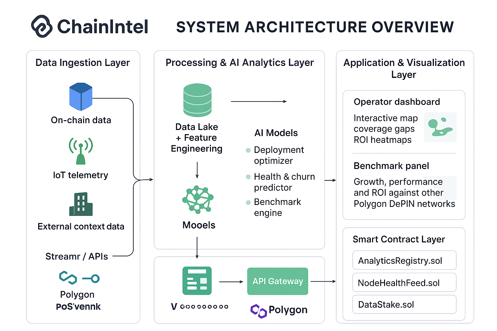

# ChainIntel - AI-Powered Analytics for DePIN Infrastructure

  

**ChainIntel** delivers predictive maintenance and real-time operational alerts for DePIN networks. Unlike general analytics platforms (Dune, The Graph), we focus on **AI-powered predictions that prevent failures before they happen** - alerting network operators when nodes will fail, infrastructure needs expansion, or performance degradation is imminent.

## 🎯 Wave 1 Deliverables (Polygon Buildathon)

This repository contains our **Wave 1 MVP** demonstrating technical feasibility:

- **Working data pipeline** - Fetches live data from DIMO Network (140K+ connected vehicles)
- **ML forecasting model** - Prophet-based time-series forecasting with 90% confidence intervals
- **Interactive dashboard** - Real-time visualization of network metrics and growth predictions
- **Professional documentation** - Complete setup instructions and architecture docs
- **Demo video** - 3-minute walkthrough (to be done)

## 🚀 Quick Start

### Prerequisites

- Python 3.9+
- Node.js 18+
- npm or yarn

### Backend Setup

```bash
cd backend

# Create virtual environment
python -m venv venv
source venv/bin/activate  # On Windows: venv\Scripts\activate

# Install dependencies
pip install -r requirements.txt

# Configure environment
cp .env.example .env
# Edit .env with your credentials (optional for Wave 1)

# Run the server
python main.py
```

The backend API will be available at `http://localhost:8000`

API Documentation: `http://localhost:8000/docs`

### Frontend Setup

```bash
cd frontend

# Install dependencies
npm install

# Configure environment
cp .env.example .env.local
# NEXT_PUBLIC_API_URL=http://localhost:8000

# Run the development server
npm run dev
```

The dashboard will be available at `http://localhost:3000`

## 📊 Features

### Current (Wave 1)

- **Live DIMO Network Data**: Real-time metrics from 140K+ connected vehicles
- **Historical Analytics**: 90-day network growth visualization
- **ML Forecasting**: 180-day growth predictions using Facebook Prophet
- **Growth Rate Analysis**: Daily, weekly, and monthly growth metrics
- **Interactive Charts**: Beautiful visualizations with Chart.js
- **REST API**: FastAPI backend with auto-generated OpenAPI docs

### Coming Soon (Wave 2+)

- **Real Historical Data**: The Graph integration for blockchain-indexed DIMO vehicle mints
- **Multi-network support**: GEODNET, IoTeX data pipelines
- **Predictive Maintenance**: ML models predicting node failures 24-48h in advance
- **Real-time Alerts**: SMS/Email/Discord notifications for critical events
- **Geographic Optimization**: AI recommendations for optimal node deployment locations
- **Smart contract marketplace**: Polygon-based analytics marketplace

## 🏗️ Architecture




## 🛠️ Tech Stack

### Backend
- **FastAPI** - Modern Python web framework
- **Prophet** - Facebook's time-series forecasting library
- **Supabase** - PostgreSQL database (managed)
- **DIMO Python SDK** - Official SDK for DIMO Network data

### Frontend
- **Next.js 14** - React framework with TypeScript
- **Tailwind CSS** - Utility-first CSS framework
- **Chart.js** - Interactive data visualization
- **Axios** - HTTP client

### Infrastructure
- **Polygon Network** - DIMO runs on Polygon for scalability
- **Vercel** - Frontend deployment (planned)
- **Render** - Backend deployment (planned)

## 📁 Project Structure

```
chainintel/
├── backend/
│   ├── main.py              # FastAPI application
│   ├── config.py            # Configuration management
│   ├── requirements.txt     # Python dependencies
│   ├── data/
│   │   ├── dimo_client.py   # DIMO API client
│   │   └── database.py      # Supabase database client
│   ├── models/
│   │   └── forecaster.py    # Prophet ML model
│   └── routes/
│       ├── dimo.py          # DIMO endpoints
│       └── analytics.py     # Analytics endpoints
├── frontend/
│   ├── src/
│   │   ├── pages/
│   │   │   └── index.tsx    # Main dashboard
│   │   ├── components/
│   │   │   ├── StatCard.tsx
│   │   │   ├── LineChart.tsx
│   │   │   └── LoadingSpinner.tsx
│   │   ├── lib/
│   │   │   └── api.ts       # API client
│   │   └── styles/
│   │       └── globals.css
│   ├── package.json
│   └── tsconfig.json
└── docs/
    ├── ARCHITECTURE.md
    ├── API.md
    └── DEPLOYMENT.md
```

## 🔑 API Endpoints

### DIMO Data
- `GET /api/dimo/metrics` - Current network statistics
- `GET /api/dimo/historical?days=90` - Historical data
- `GET /api/dimo/health` - API health check

### Analytics
- `POST /api/analytics/forecast?days_ahead=180` - Generate ML forecast
- `GET /api/analytics/forecast/latest` - Get latest forecast
- `GET /api/analytics/growth-rate` - Growth rate analysis
- `GET /api/analytics/summary` - Comprehensive summary

Full API documentation available at `/docs` when running the backend.

## 🧪 Testing

### Backend Tests
```bash
cd backend
pytest  # Coming soon
```

### Frontend Tests
```bash
cd frontend
npm test  # Coming soon
```

## 📈 ML Model Details

**Prophet Time-Series Forecasting**

- **Training Data**: 90 days of historical DIMO network metrics
- **Forecast Horizon**: 180 days (configurable)
- **Confidence Level**: 90% intervals
- **Seasonality**: Weekly and yearly patterns detected
- **Validation**: 14-day test set with MAE, RMSE, MAPE metrics

**Key Predictions**:
- 30-day growth forecast
- 90-day growth forecast
- 180-day growth forecast
- Average daily growth rate
- Trend acceleration/deceleration

## 🎥 Demo Video

[Watch the 3-minute demo video](link-to-loom-video)

--- 

## 🗺️ Roadmap (Tentative)


### **Wave 1 (Weeks 1–2) ✅ – Foundation & Proof of Concept**

- [x] Connect to **DIMO API** and fetch live network metrics
- [x] Build backend (FastAPI + Supabase) for data ingestion
* [x] Train **Prophet ML model** for time-series growth forecasting
* [x] Develop **Next.js dashboard** to visualize metrics and forecasts
* [x] Publish GitHub repo with documentation and architecture notes
* [x] Record 3-minute Loom demo (data → ML → dashboard flow)

---

### **Wave 2 (Weeks 3–4) 🚧 – Real Data + Multi-Network**

* [ ] Integrate **The Graph** to index DIMO vehicle NFT mints on Polygon (real historical data)
* [ ] Add **GEODNET** and **IoTeX** data integrations
* [ ] Implement **anomaly detection** ML model for network health monitoring
* [ ] Build **geographic clustering** analysis for coverage gaps
* [ ] Deploy basic smart contract on Polygon testnet
* [ ] Launch free tier with 5 analytics products

---

### **Wave 3 (Weeks 5–6) 🔒 – Predictive Alerts + Beta Users**

* [ ] Build **predictive maintenance model** (forecast node failures 24-48h ahead)
* [ ] Implement **real-time alert system** (Email/Discord notifications)
* [ ] Deploy **AnalyticsRegistry.sol** for on-chain verification
* [ ] Automate daily analytics generation (cron/Airflow)
* [ ] Onboard **10-15 beta users** (free tier) for feedback

---

### **Wave 4 (Weeks 7–8) 💼 – Product Refinement + Growth**

* [ ] Expand to **25-30 active beta users** across multiple networks
* [ ] Launch **10+ analytics products** (ROI optimizer, geographic gaps, etc.)
* [ ] Release public **API + SDK** for developer integrations
* [ ] Collect testimonials and usage metrics for investor materials
* [ ] Build premium tier feature set (advanced alerts, custom ML models)

---

### **Wave 5 (Weeks 9–10) 🎤 – Fundraising Preparation**

* [ ] Prepare investor **pitch deck** with user traction (30+ active users)
* [ ] Create **demo video** showcasing predictive alerts preventing real failures
* [ ] Announce **partnership with 1 major DePIN network** (official analytics provider)
* [ ] Draft tokenomics framework (if pursuing token model)
* [ ] Begin conversations with seed investors ($500K-$1M target)

---

### **Wave 6 (Weeks 11–12) 🚀 – Monetization Launch**

* [ ] Launch **paid tier** with advanced predictive alerts ($50-$200/month)
* [ ] Acquire **first 3-5 paying customers** (proof of willingness to pay)
* [ ] Integrate **10+ DePIN networks** (Helium, Render, Filecoin, Akash)
* [ ] Deploy mainnet smart contracts on Polygon
* [ ] Hire first team member (backend engineer or BD) if funded

---

### **Wave 7 (Weeks 13–14) 🏢 – Scale + Enterprise Features**

* [ ] Grow to **10-15 paying customers** ($500-$2K MRR)
* [ ] Launch **white-label platform** prototype for network operators
* [ ] Add **custom analytics builder** for self-serve reports
* [ ] Begin SOC2/GDPR compliance process
* [ ] Establish customer success processes and SLAs

---

### **Wave 8 (Weeks 15–16) 🌐 – Cross-Chain + Advanced AI**

* [ ] Add support for **Solana, Base, Arbitrum** DePIN projects
* [ ] Build **cross-chain analytics dashboard**
* [ ] Launch **AI chatbot** for natural language queries ("when will my network reach 200K nodes?")
* [ ] Integrate **15-20 total DePIN networks**
* [ ] Target **$5K-$10K MRR** from 15-20 paying customers

---

### **Wave 9 (Weeks 17–18) 🤖 – Advanced Features + Partnerships**

* [ ] Announce **official partnership** with major DePIN network (DIMO/Helium/GEODNET)
* [ ] Launch **automated optimization recommendations** (AI suggests node placements)
* [ ] Build **benchmark comparisons** dashboard (compare networks)
* [ ] Create case studies showing **ROI from using ChainIntel**
* [ ] Grow to **25-30 paying customers** ($10K-$15K MRR)

---

### **Wave 10 (Weeks 19–20) 💰 – Fundraising Execution**

* [ ] Target **$20K-$30K MRR** with **35-40 paying customers**
* [ ] Complete **Series A pitch deck** with 6-month financial projections
* [ ] Secure **letters of intent** from 2-3 major DePIN networks
* [ ] Begin formal **Series A fundraising process** ($3M-$5M target)
* [ ] Present at major conference (TOKEN2049, ETHDenver, or Polygon event)

---


## 🤝 Contributing

We're currently in stealth mode for the buildathon, but contributions will be welcome post-Wave 1!

## 📄 License

MIT License - See LICENSE file for details

## 👥 Team

Solo developer project for Polygon Buildathon: From Launch to Fundraising

## 🔗 Links

- **Live Demo**: [Coming Soon]
- **Documentation**: [docs/](./docs)
- **DIMO Network**: https://dimo.org
- **Polygon**: https://polygon.technology

## 💡 Vision

ChainIntel aims to become **the predictive operations platform preventing DePIN infrastructure failures before they happen**. Unlike Dune/The Graph (historical data), we focus on **AI-powered predictions** that help operators:

- **Prevent node failures** 24-48 hours before they occur
- **Optimize infrastructure expansion** with geographic gap analysis
- **Reduce operational costs** through predictive maintenance
- **Make data-driven decisions** backed by ML forecasts

**Built on Polygon** for scalability and deep integration with the DePIN ecosystem.

---

**Questions?** Create an issue or contact us at [your-email]

**Building the future of DePIN analytics, one wave at a time.** 🌊
